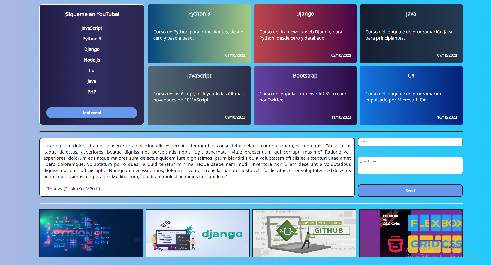
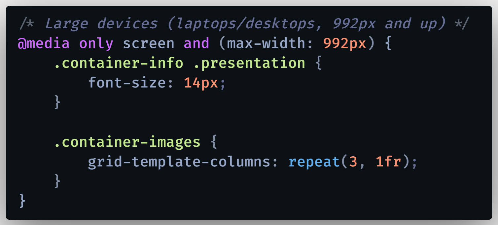

# CSS Grid - Flexbox: Ejemplo práctico para despegar como developer 🚀

Aprende a utilizar CSS Grid y Flexbox en tus sitios web, entendiendo sus conceptos básicos y fundamentos de diseño, de esta manera podrás estilizar tus aplicaciones web muy fácilmente y volverlas responsivas (Responsive Design). Aprende a crear páginas web responsivas y conoce las similitudes y diferencias entre CSS Grid y Flexbox, cuándo usar uno u otro y para cuáles tipos de diseño es mejor cada uno de ellos.

#### 🔴 &emsp; 🔴 &emsp; 🔴 &emsp; YOUTUBER RECOMENDADO &emsp; <a href="https://www.youtube.com/@UskoKruM2010" target="_blank" > UskoKruM2010 </a> &emsp; 🔴 &emsp; 🔴 &emsp; 🔴

 

  

  

   

<h2 align="center">🌍 &emsp; <em> Find me on...</em> &emsp; 🌎 </h2>

  

