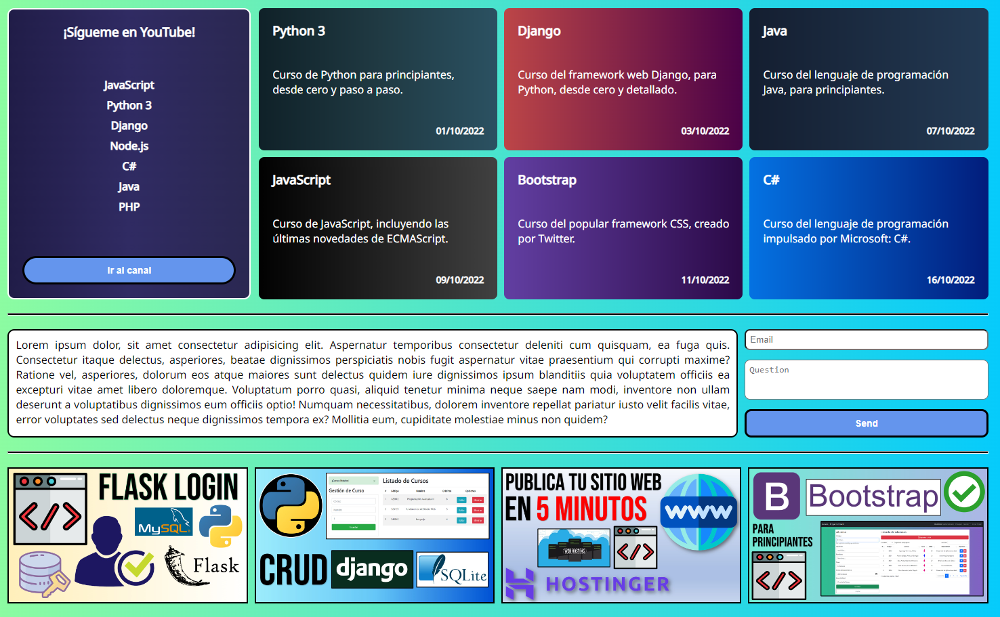

# CSS Grid - Flexbox: Ejemplo práctico para despegar como developer 🚀

Aprende a utilizar CSS Grid y Flexbox en tus sitios web, entendiendo sus conceptos básicos y fundamentos de diseño, de esta manera podrás estilizar tus aplicaciones web muy fácilmente y volverlas responsivas (Responsive Design). Aprende a crear páginas web responsivas y conoce las similitudes y diferencias entre CSS Grid y Flexbox, cuándo usar uno u otro y para cuáles tipos de diseño es mejor cada uno de ellos.

🔴 *** YOUTUBER RECOMENDADO *** 
YouTube: : https://www.youtube.com/@UskoKruM2010 
¡Usa el código USKOKRUM2010 para un buen descuento!

  

  

# 🌍 Por si deseas contactarme 👩🏻‍💻 :
